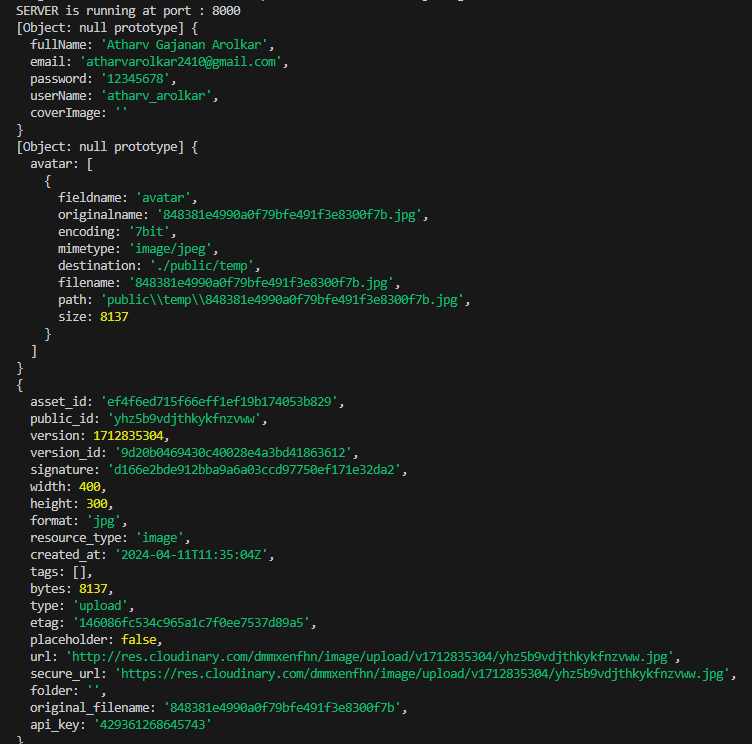

# Learn backend series

# Generate .gitignore

- https://mrkandreev.name/snippets/gitignore-generator/#Node

## Install nodemon to watch

whenever connecting with db always use try catch, and dont forget to use async await

app.use is used for middleware

highwer order fucntion

bcrypt help-s tp hash password

jwt is a bearer token
bearer token: anyone send me this token, ill send the data

console logged request body, request files and cloudinary response

### Refresh token : Long lived token
    - Used to refresh the access token. If token expires, the user has to manually login, and get himself authenticated.

### Access token : Short lived token 
    - If we have access token, no need to authroise the user. If it expires, user is redirected to hit a url, and if the refresh token is valid, the use is given a new access token
